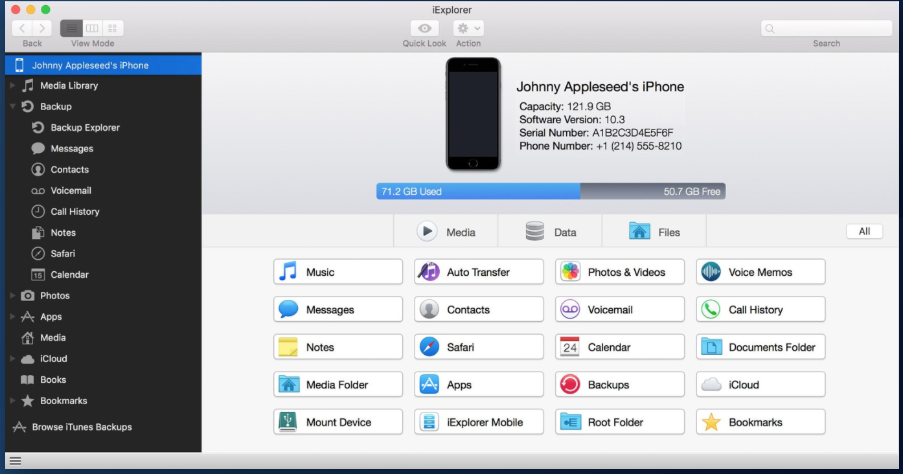

##iOS App Security##

##Test Cases / Verification Procedures##

###**1) Insecure Data Storage:**###

**Check Application Log files:**

1) Plug in your iPhone device to a mac machine & open XCode.

2) Go to organizer -> Select the device that you have connected.

3) For setting console logs, Device Logs click on "Export" / "Download" & choose the location where you want the logs.

**Check all functionality of the app**

- [Donwload](https://macroplant.com/iexplorer) ``iExplorer``  & install on your mac & connect iPhone to it.

- Verify sensitive information storage
      - Snapshots
      - Documents

####Recommendations####
 
 - To protect sensitive data, block caching of application snapshot using api configuration or code use ``willEnterBackground`` API

- When an iOS app is going to be sent to background ensure the app is not displaying any sensitive information. Create a splash screen for the app & display this as it moves into the background.

- Mask the sensitive information being displayed on the screen.
 
**iPhone Analyzer**

- [Download](https://iphone-analyzer.soft112.com/) ``iPhone Analyzer`` & install it on mac.

- Open iTunes & connect your device to it. Right click on the device & select ``Backup``.

- Run iPhone Analyzer as "java -jar <iPhone expoler.jar> & open the backup stored at default location

- Verify the following points for sensitive information storage:
	
	- Custom created files
	- Plist files
	- cookies.bainaryCookies
	- DocumentDirectory

###Recommendation###

- All the keystorkes entered on an iPhone get potentially stored in a file called ``dynamic-data.txt`` on device. Hence set ``Autocomplete = OFF`` for the UITextFields. Also, for one of the project the application writes logs to a local file in the applications ``Document Directory`` ``~/Documents/yourApp.txt``

	
**SQLite DB of application on device**

- Install Firefox & install [Sqlite Manager Plugin](https://addons.mozilla.org/en-US/firefox/addon/sqlite-manager/) for SQLite explor.

- Connect you iPhone device to Mac Laptop.

- Open iExplorer -> Select CMW app -> Library & mClientDB.sql export it to desktop.

- Open sqlite manager plugin and browse the .sqlite db file just downloaded.

- Verify the sensitive storage information.

##Recommendation##

- Where storage or caching of information is necessary consider using a standard iOS encryption library such as CommonCrypto

- For database consider using SQLCiper for SQLite data encryption.

- Avoid using ``UserDefaults`` to store sensitive information as it stores in the plist file.

- In iOS 4 onwards when an application moves to the background the system takes a screen shot of the application current view / application main window. This screen shot is used to animate the transition from background to foreground. screenshot stored in the applications ``Library/Caches/Snapshots/com.companyName.applicationName`` directory.

- [Mobile Forensic Kit](https://www.elcomsoft.com/)

**Following piece of information should not be stored in the device** 

	 1) Usernames
	 2) Authetication tokens
	 3) Passwords
	 4) Cookies
	 5) Location Data (Latitude, Longitude) 
	 6) UDID, VendorId, IMEI, Device Name, Network connection Name
	 7) Personal Information such as
	    - Name of the user
	    - DOB
	    - Address
	    - Social Information 
	    - Credit card data
	 8) Application Data: 
	    - Stored application logs
	    - Debug information 
	    - Cached application messages
	    - Transaction history 

  
