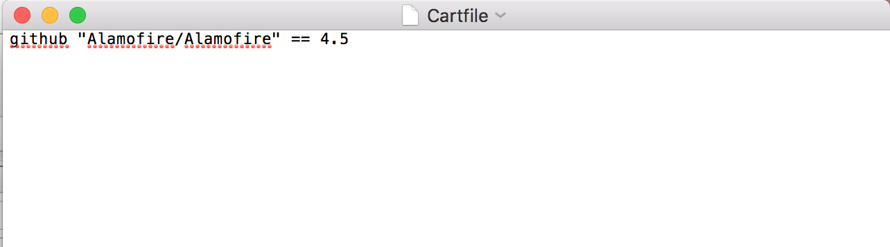
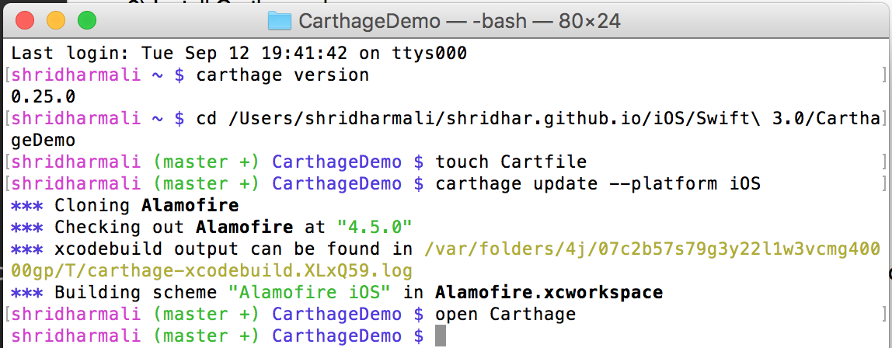
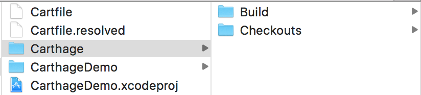
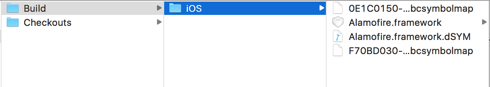
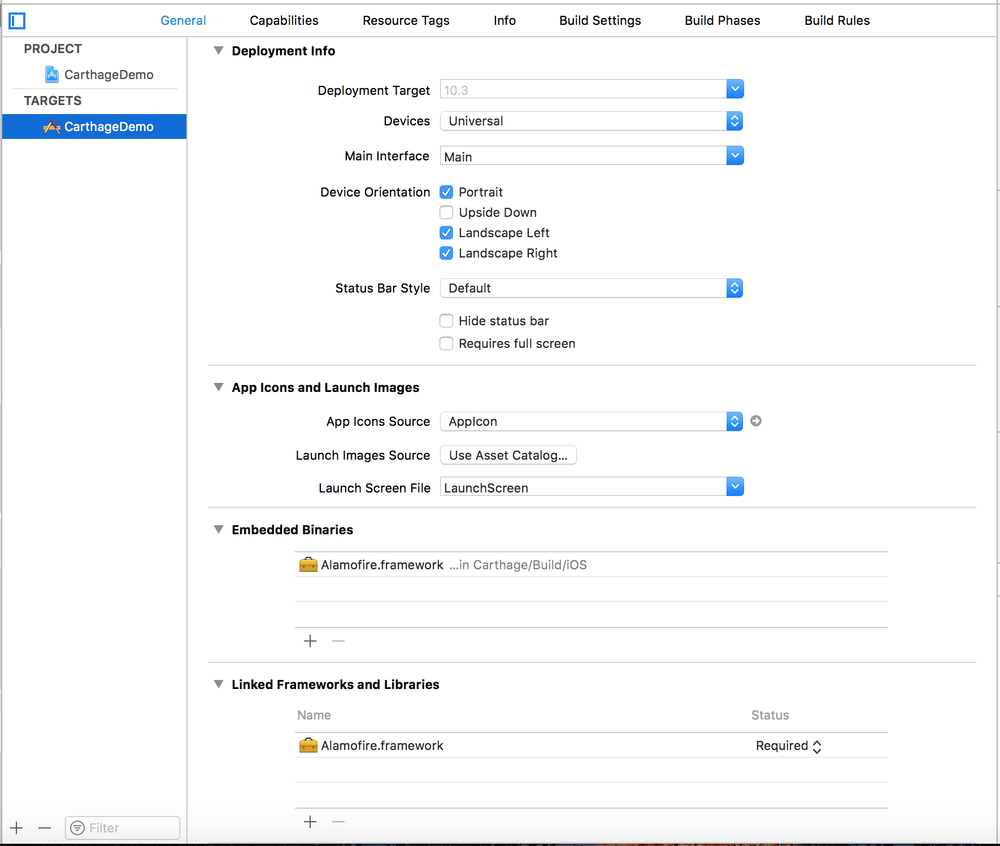
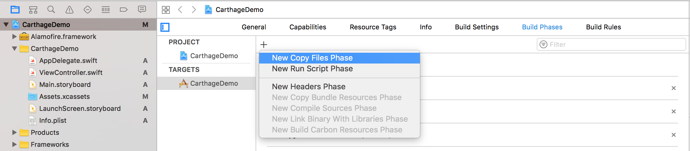
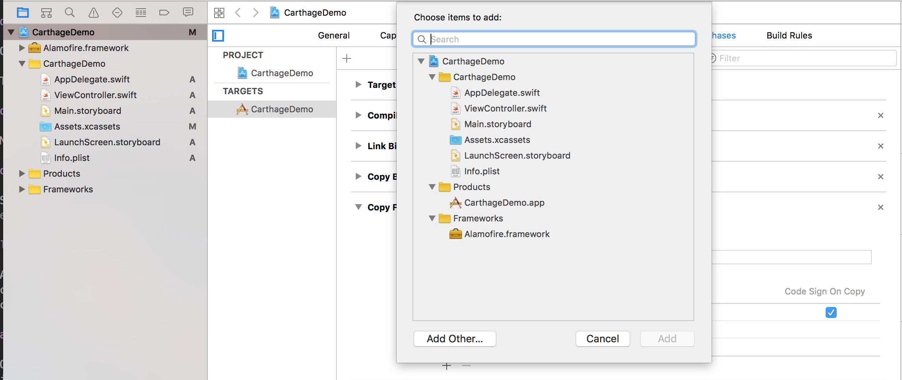
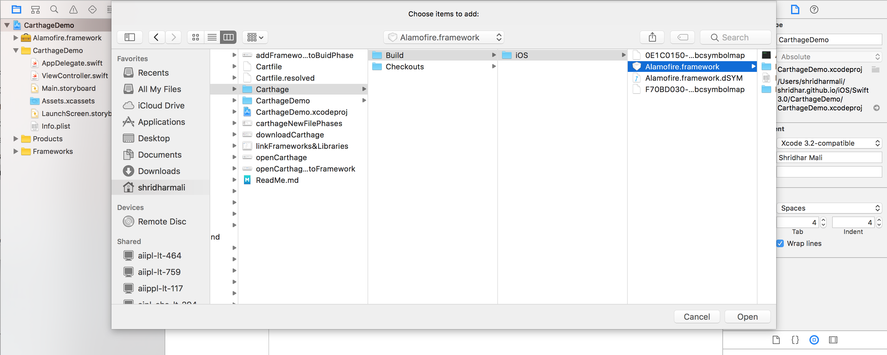

# How to use Carthage

Steps:

1) Download latest Carthage from `https://github.com/Carthage/Carthage/releases`

2) Install Carthage.pkg

3) Check carthage version --> Open terminal  --> type --> `Carthage version`

4) `Carthage version` command give you latest version of carthage which recently installed (eg. `0.25.0`)

5) Now, Navigate upto project directory 

6) Type `touch Cartfile` This commond will create empty cartfile in project directory.

7) Open `Cartfile` and add dependency. eg `github "Alamofire/Alamofire" == 4.5`

8) Save Cartfile.

9) Type command in terminal `Carthage update --platform iOS` for download dependancy in project.

10) Once dependancy downloaded type command `open Carthage`

11) This will open carthage folder in the project

12) Navigate `Build --> iOS` you will get dependancy `.framework`

13) Select --> Target --> General --> Drag & drop framework into `Linked frameworks and Libraries`

14) Add framework into `Build Phases` 
select project target --> Build Phases --> Click on `+` on the top and select `New Copy Files Phases`.

15) Once Added `New Copy Files Phases` you will get the `Copy Files` section. 
Select `Destination` for `Frameworks` 

16) On Bottom `+` select

17) Select --> Add other --> Navigate upto your dependancy `.framework` -> Open

18) Select Copy

19) Your are ready to use your dependancy in project --> Build and Run 

  
