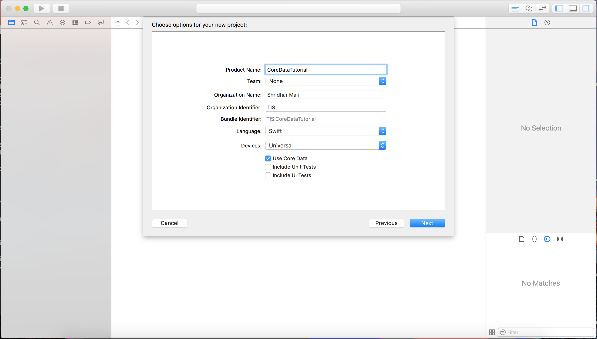
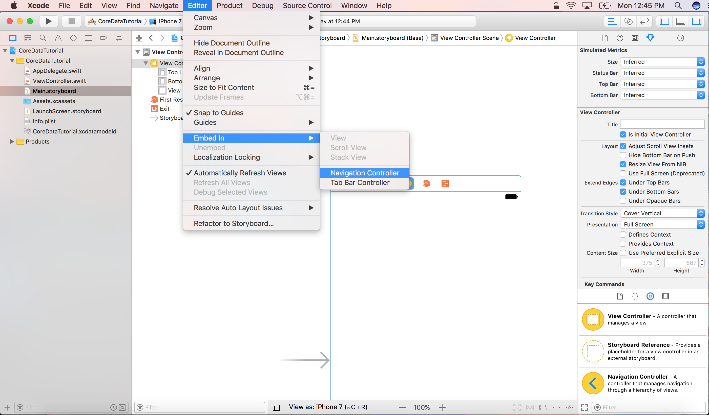
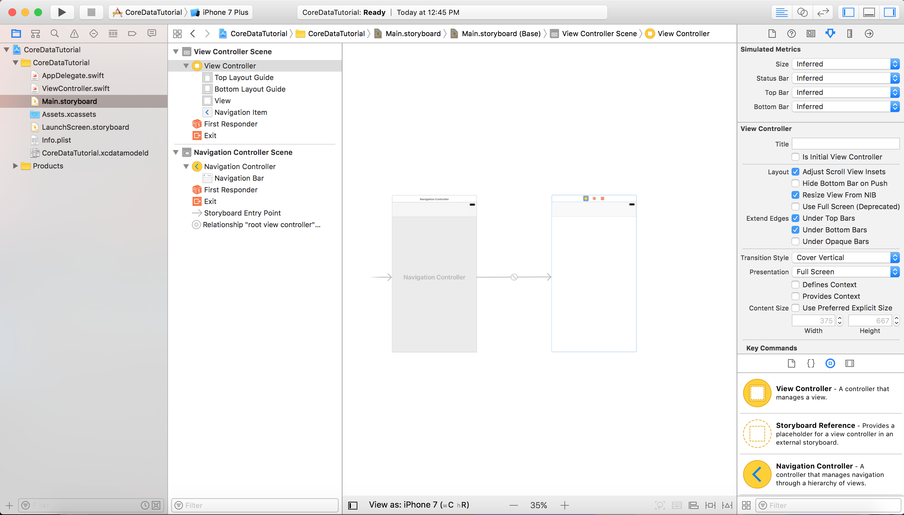
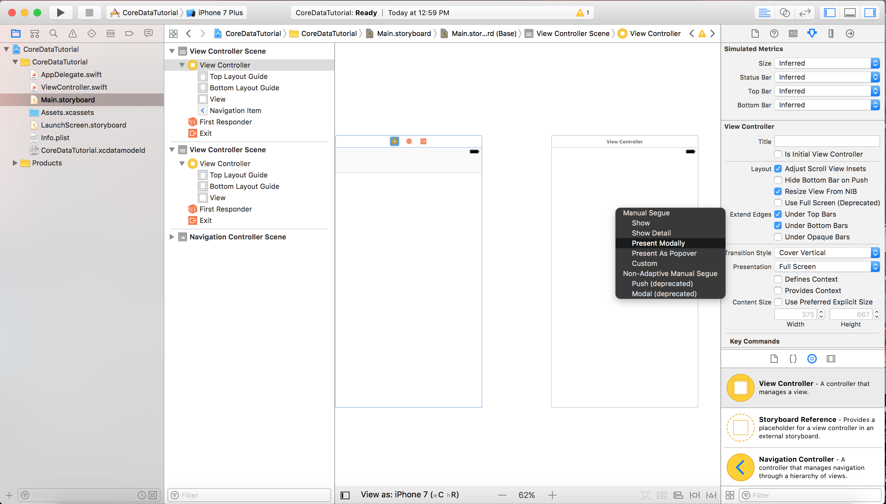
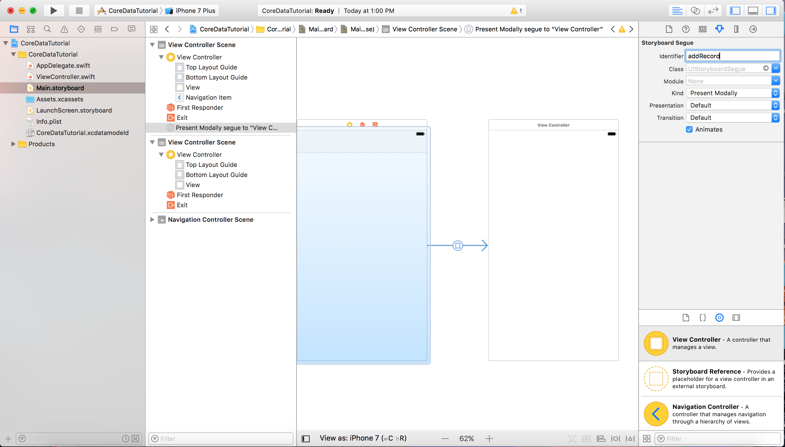
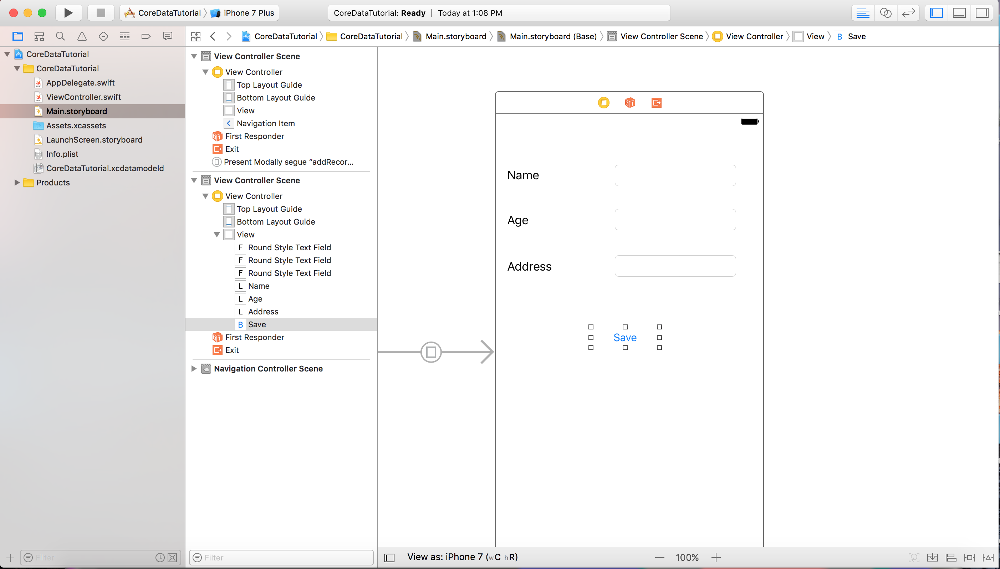

## Core Data

- Core data is not a database, It is a framework that lets developers store or retrive data in database in object oriented way.

- Sqlite is the default persistant store of core data.

- Core data support following persistant stores.
  1. NSSqliteStoreType
  2. NSXMLStoreType
  3. NSBinaryStoreType
  4. NSInMemoryStoreType
- Core data is not a relational databse.

## Core Data Stack


### Managed Object Context 

- Its job is to manage objects created & returned using core data.
- Whenever you need to fetch, save, edit & delete object in persistant store **Context** is the first component you talk to. 
- It is a scratch pad containing objects that interacts with data in persistant store.

### Persistant Store Coordinator

- SQLite is different persistant store in core data.
- Core data allows developers to set ups multiple store containing different entities.
- Persistant store coordinator is partly responsible to manage persistant object store & save the objects to store.


### Managed Object Model

- It describes the schema that you uses in the app.
- Schema is represented by collection of objects (Also known as entities)
- Managed Object Model is defined in a file with the extension **.xcdatamodeld**
- You can use visual editor to define the entities & their attributes as well as relationships.


## Steps to create core data example

1) Open Xcode -> File -> New -> Project -> Select Single View Application Template -> Name it **CoreDataTutorial** select **Use Core Data** checkbox




2) Open Main.storyboard file, selecte view controller xib file and Embed in Navigation controller.



After Embed view controller it will be look like following screen



3) We have to design application for Insert, Select, Update and Delete operations.

Add ***rightBarButtonItem*** on the navigationBar using following code in viewWillAppear of ViewController 

```
self.navigationItem.rightBarButtonItem = UIBarButtonItem(title: "Add", style: .plain, target: self, action: #selector(self.addRecord))

```

```
func addRecord() {
        
}
    
```

4) Add ViewController for Insert record in the database.

Drag ViewController from Library and drop into Main.storyboard, Make connection from ViewController to dragged ViewController using Control Key -> Select Present Modally.



Add identifier **addRecord** for segue 



5) Design Screen for Insert Record with fields
Name, Age and Address and a buttons for save.



6) Add new file of **AddPatientViewController** of type UIViewController and assign to this ViewController also create IBOutlets of all controls 

```
	@IBOutlet weak var nameTxt: UITextField!
    @IBOutlet weak var ageTxt: UITextField!
    @IBOutlet weak var addressTxt: UITextField!
    @IBOutlet weak var saveBtn: UIButton!
    
```

Create IBAction of Save Button

```

@IBAction func saveBtnClicked(_ sender: Any) {
    }
    
```


  