## Xcode Build Configurations

### Q. Why xcode build configuration?

  When testing an application, compiled code is not optimized because it gives the debugger more information, allowing you to step through code with LLDB. When releasing to the app store, code is optimized to run faster and make up less memory, but you wouldn't be able to use the debugger to accurately diagonse the issues.
  
Since it make sense to be able to toggle between optimized code for releasing an application and non-optimized code for debugging an application, xcode has the concept of Build Configurations. Each one has its own set of values for each possible Build Settings. When you build the application, you choose which configuration you'd like to use.


Start to create new build configurations in xcode for different servers or different purposes.


When you create new project, two cofigurations are automatically created, ***Debug*** and ***Release***.

### Adding Configurations
For a moment we assume that your application dealing with the web service and you have to three different servers ***Test***, ***Development*** and ***Production*** 


## Steps

1) Add Configuration:
 Duplicate "Debug" Configuration
 
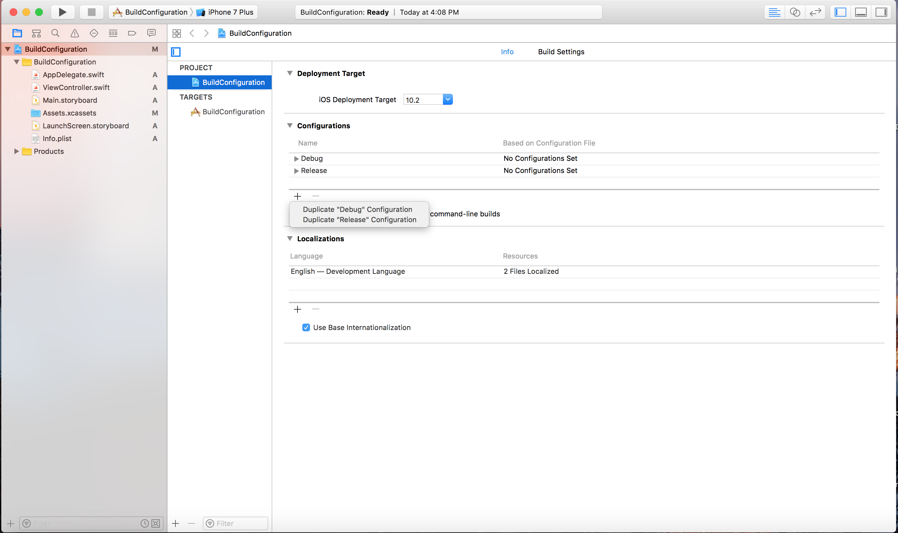


2) Name it "AdHoc" 

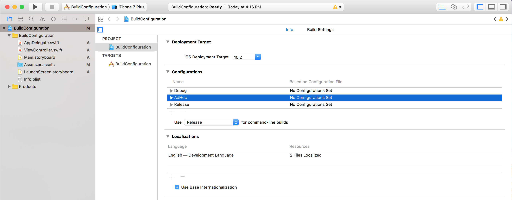

3) Select TARGETS (BuildCofiguration) -> Build Settings -> Add User-Defined Setting

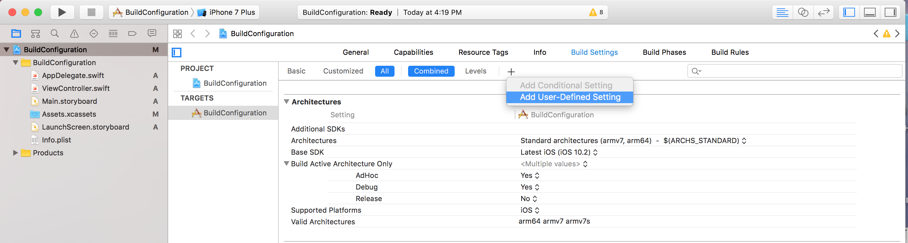

4) Rename it to `API_CONFIGURATION_ENDPOINTS`

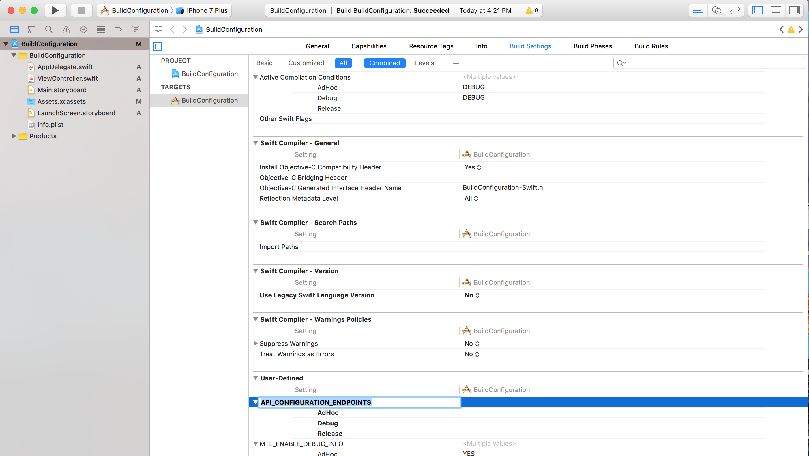

5) Storing the `API_CONFIGURATION_ENDPOINTS` in Info.plist

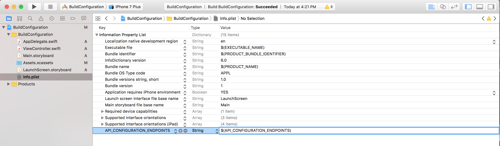

6) Add `API_CONFIGURATION_ENDPOINTS` values in Build settings

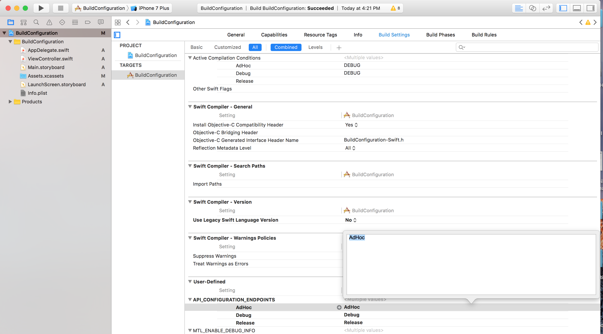

7) Add new Swift file 

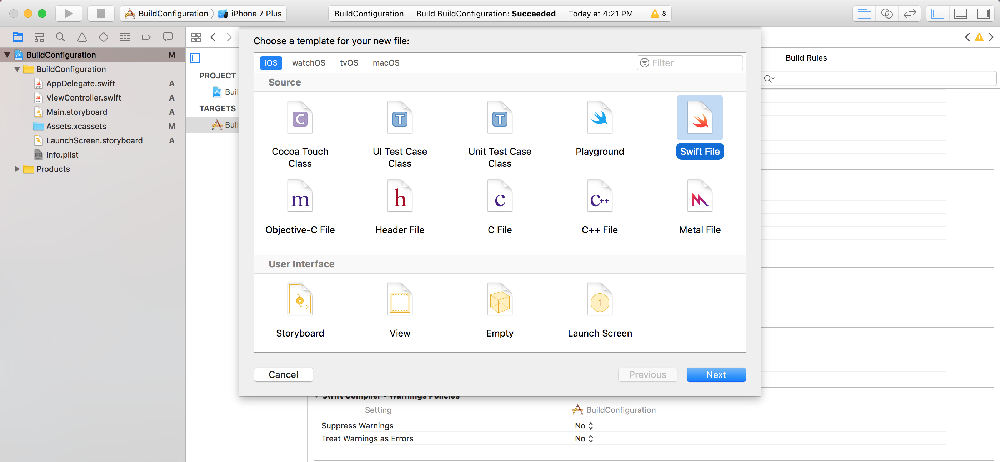

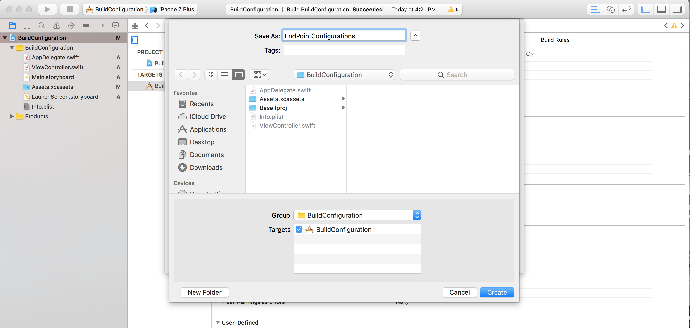

8) Add below code in `EndPointConfiguration.swift` file

```

public enum Enviornment: String {
    case Debug = "Debug"
    case AdHoc = "AdHoc"
    case Release = "Release"
    
    var serverBaseUrl : String {
        switch self {
        case .Debug : return "https://www.debugServer.com"
        case .AdHoc : return "https://www.adHocServer.com"
        case .Release: return "https://www.releaseServer.com"
            
        }
    }
}

public struct Configuration {
    static var enviornment : Enviornment {
        if let configuration = Bundle.main.object(forInfoDictionaryKey: "APP_ENVIORNMENT_CONFIGURATION") as? String {
            if let _ = configuration.range(of: "Debug") {
                return Enviornment.Debug
            }
            if let _ = configuration.range(of: "AdHoc") {
                return Enviornment.AdHoc
            }
            if let _ = configuration.range(of: "Release") {
                return Enviornment.Release
            }
            
            // Add more configurations here
            
        }
        // Default Debug will be return
        return Enviornment.Debug
    }
}

```

9) Manage Schemes as per configuration
Select BuildConfiguration target near the play/stop button on the top and select Manage Scheme.

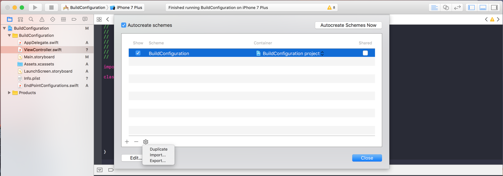

Select BuildConfiguration and click in Gear icon button -> Duplicate pop up will appear and add your Build configurations for `AdHoc` and `Release`

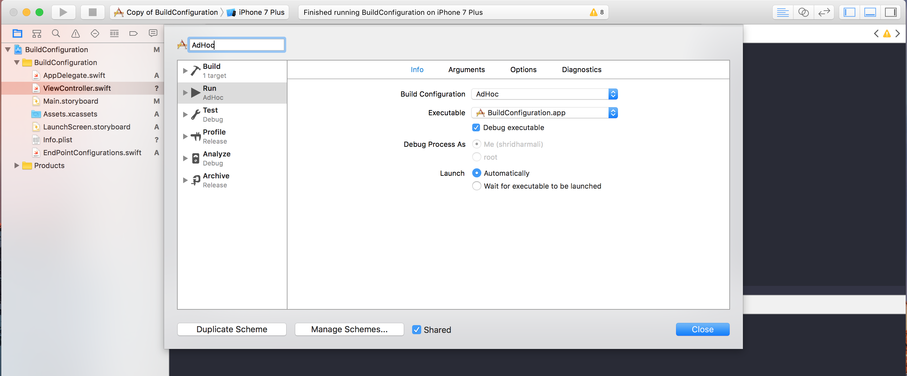

10) Edit all schemes as per build configurations for `Run` , `Test` , `Profile` , `Analyze` , `Archive` 

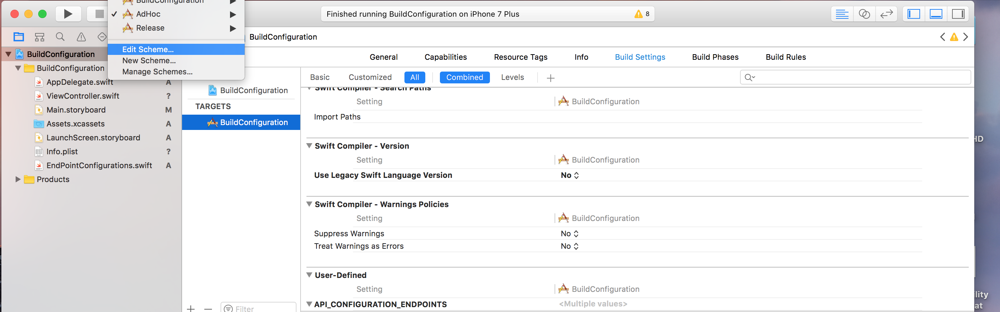

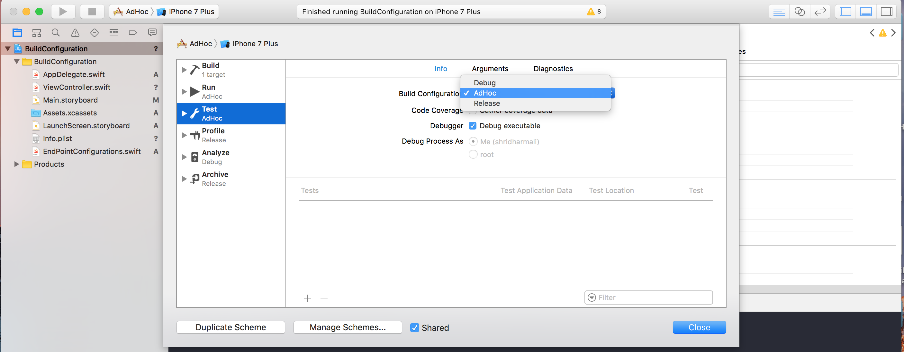 

11) Get configuration using `Configuration.enviornment.serverBaseUrl` in the application.


